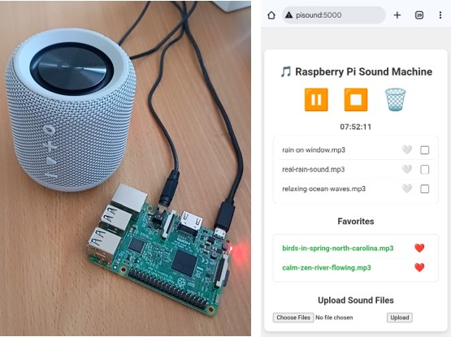

# Raspberry Pi Sound Machine with Browser Interface

This project turns a Raspberry Pi into a customizable sound machine.<br>
User can upload own sound files and play them through a web interface, creating a personalized soundscape to mask unwanted
 noise or for relaxation.<br>
The interface allows playing multiple sounds simultaneously.
The sounds are looping infinitely.



## Background idea of this project

Sometimes there's a very low-frequency noise in my apartment, which I believe is coming from installations or equipment in the
 building. This can be very disturbing.
It inspired me making this sound machine for playing relaxing sounds that help drown out the low hum.

In general the issue about low-frequency hum is a quite widespread problem:
 [Noise & Health](https://journals.lww.com/nohe/fulltext/2004/06230/low_frequency_noise_and_annoyance.6.aspx)

## User Guide

Connect Raspberry Pi to a loudspeaker (loudspeaker with aux input).<br>
*Note: in this user guide the Raspberry Pi hostname is **pisound** (it can be any name you choose).*


Copy **rpi_sound_machine** folder from this repository to Raspberry Pi device **/home/~** folder.<br>
Then ssh into the Raspberry Pi device and **cd** to **/home/~/rpi_sound_machine** folder.

Install necessary applications with:<br>
```make install```

 and start sound machine service with:<br>
```make start-service```

The Raspberry Pi Sound Machine is to be controlled via local network through browser: ***pisound:5000***

### Web Interface

#### Uploading Sounds

1. Click the "Choose Files" button in the "Upload Sound Files" section.
2. Select one or more sound files from your computer.
3. Click the "Upload" button to upload them to the Raspberry Pi.

I found some good sounds here: [Pixabay Free Sounds](https://pixabay.com/sound-effects/search/)

#### Playing Sounds

* **Play a sound**: Click on the name of a sound file in the "Sound Files" list to start playing it.
 The sound will loop continuously.
* **Play multiple sounds**: You can play multiple sounds at the same time by clicking on additional sound files.

#### Controls

At the top of the page, you'll find control buttons:

* **Pause/Resume (⏸️/▶️)**: Click to pause or resume all currently playing sounds.
* **Stop (⏹️)**: Click to stop all sounds.
* **Delete (🗑️)**: To delete files, check the boxes next to the file names you want to delete, then click this button.

#### Timer

A timer at the top of the page (below control buttons) shows how long the currently playing sounds have been active.

## Development guide

### Install UV on PC

Install **uv** according to:
 [installation of uv](https://github.com/christianhansenx/hansen-developer-notes/blob/main/tools-and-apps/uv/README.MD)

### Install "just" on PC

Install **just** according to:
 [installation of just](https://github.com/christianhansenx/hansen-developer-notes/blob/main/tools-and-apps/just/README.MD)

Too see list of **just** recipes, execute **just** without recipe argument: ```just```

If you are on Windows, then run the **just** recipes in Git Bash (download from  [git](https://git-scm.com/))<br>
[Setting up VS code to use Git Bash terminal](https://github.com/christianhansenx/hansen-developer-notes/blob/main/tools-and-apps/vs-code/README.MD#windows---git-bash-terminal)

### Interfacing with Raspberry Pi from PC

Instead of having to do manually SSH into the RPI, then many operations can be applied by using the **just rpi** recipes in
 **rpi-remote-tools/justfile**.<br>
To get a list of RPI remote tool commands then execute ```just rpi``` (on the PC) without arguments.

Example of running a command: ```just rpi check```.
```
Create SSH connection to pi@pisound

== Remote command to RPI: make stop-app
python developer_tools/application_utilities.py --stop-application
UTC time: 2025-11-29 12:38:21
Python version: 3.11
Running processes of "sound_machine.py":
  USER      PID %CPU %MEM    VSZ   RSS TTY  STAT START   TIME COMMAND
  pi     103220  0.4  3.1 217756 28816 ?    Sl   12:36   0:00 /snap/astral-uv/1086/bin/uv run --no-group dev sound_machine.py
  pi     103251  5.3  4.7 233252 44072 ?    Sl   12:36   0:07 /home/pi/rpi_sound_machine/.venv/bin/python3 sound_machine.py
Killing process ".venv/bin/python...sound_machine.py". PID(s): 103251
Failed to kill "sound_machine.py" (PID 103251) with SIGTERM
Successfully killed PID 103251 with SIGINT

== Remote command to RPI: make kill-tmux
python developer_tools/application_utilities.py --kill-tmux
UTC time: 2025-11-29 12:38:25
Python version: 3.11
There is no tmux session for "sound" to close!

== Remote command to RPI: make stop-service
python developer_tools/application_utilities.py --stop-service
UTC time: 2025-11-29 12:38:25
Python version: 3.11
Removing service sound-machine.service

== Remote command to RPI: make start-service
python developer_tools/application_utilities.py --start-service
UTC time: 2025-11-29 12:38:28
Python version: 3.11
Service "sound-machine.service" has been started successfully!
```

Some of the connections to the RPI are using [tmux](https://github.com/tmux/tmux/wiki) terminal on the RPI.<br>
When running tmux from tools terminal, it can be stopped by pressing **enter** key.
